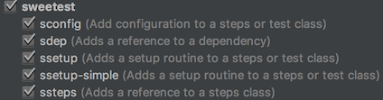

# sweetest test development guidelines

After some time working with sweetest we came to the conclusion there are a lot of different ways to design tests but also an increasing need for alignment. These guidelines are here to reach an appropriate level of such alignment. Feel free to challenge the current state and to contribute!

## Contents

- [Goals](#goals)
- [Introduction](#introduction)
    - [Use the live templates!](#use-the-live-templates)
    - [Add a module configuration](#add-a-module-configuration)
    - [Add dependencies to the configuration](#add-dependencies-to-the-configuration)
    - [Create a steps class](#create-a-steps-class)
    - [Create a test class](#create-a-test-class)
    - [Define test cases](#define-test-cases)
    - [Add configuration in the steps class](#add-configuration-in-the-steps-class)
    - [Add access to the dependencies in the steps class](#add-access-to-the-dependencies-in-the-steps-class)
      - [Add the `given` function](#add-the-given-function)
      - [Add the `when` function](#add-the-when-function)
      - [Add the `then` function](#add-the-then-function)
    - [Current state](#current-state-of-the-example)
    - [Improving structure by reusing test code](#further-improve-structure-by-reusing-code)
      - [The fake backend](#the-fake-backend)
      - [Create the steps class for the unit test](#create-the-steps-class-for-the-unit-test)
      - [Create the test class](#create-the-test-class)
      - [Use the fake backend in the integration test](#use-the-fake-backend-in-the-integration-test)
    - [Summing up](#summing-up)
- [Reference](#reference)
    - [Tests](#tests)
    - [Steps](#steps)
      - [Using steps classes](#using-steps-classes)
    - [Dependencies](#dependencies)
      - [Dependency modes](#dependency-modes)
        - [Mock](#mock)
        - [Real](#real)
        - [Configuring and requiring modes](#configuring-and-requiring-modes)
        - [Offering instances](#offering-instances)
        - [Distinguish mock and real correctly](#distinguish-mock-and-real-correctly)
      - [Special case: abstract types and type hierarchies](#special-case-abstract-types-and-type-hierarchies)
        - [Lazy-initialized approach](#lazy-initialized-approach)
        - [Immediate initialization approach](#immediate-initialization-approach)
      - [Special case: spy](#special-case-spy)
    - [Module testing configuration](#module-testing-configuration)
      - [Organization by modules](#organization-by-modules)
      - [Adding dependencies](#adding-dependencies)
      - [Deprecation](#deprecation)
    - [Structuring test classes](#structuring-test-classes)
      - [Summing up naming](#summing-up-naming)
    - [Structuring steps classes](#structuring-steps-classes)
      - [Starting at the "SuT" steps class](#starting-at-the-sut-steps-class)
      - [Can there be too much abstraction?](#can-there-be-too-much-abstraction)
      - [Summing up naming](#summing-up-naming-2)
- [Links](#links)

## Goals

* Put a **layer of abstraction** on the system under test (SuT): we call these abstractions _steps_ (as derived from Cucumber)
  * so if the system under test changes, most parts of the test system don't need to change
  * so the test just tells _what_ is tested, not _how_ (tests become more business-centric; whenever possible, all _technical implementation_ is in the steps)
  * so test code, especially its technical implementation (steps classes), can be reused
* **Simplify dependency tree creation** by using configuration and automatic dependency resolution
* **Test setup is simplified** so **integration tests become default**
  * which **reduces the use of mocks** and
  * leads to **more realistic tests**

## Introduction

This introduction guides you through the setup of a typical sweetest test. Its goal is to be as comprehensive and focused as possible for people not yet familiar with sweetest. We recommend reading through the [reference section](#reference) too in order to deepen your understanding of sweetest and generally using it any time you need during development.

### Use the live templates!

If you use [IntelliJ IDEA](https://www.jetbrains.com/idea) (respectively [Android Studio](https://developer.android.com/studio)) as IDE you should use these [live templates](https://www.jetbrains.com/help/idea/using-live-templates.html) to speed up development with sweetest:


To make use of them please [download these exported IntelliJ settings](raw/master/tools/live-templates.jar) and import them into your IDE with `File / Import settings`. After the import you can see them in the settings at `Editor / Live Templates`:



You can use the templates by beginning to type the abbreviations as shown in the image above and hitting enter.

### Add a module configuration

Given you have a module `app` you have to create a file `AppModuleTestingConfiguration.kt` in the root package of your module, e.g. `com.example.app` inside the test sources.

```kotlin
val appModuleTestingConfiguration = moduleTestingConfiguration { ... }
```

This is a top-level declaration, so that is all there is in this file.

To learn more about the module testing configuration have a look at the [respective chapter in the reference](#module-testing-configuration).

### Add dependencies to the configuration

sweetest provides necessary test dependencies for you through the configuration you provided within the above mentioned module configuration file. If you have a complex system under test you don't have to create the dependencies manually. In case a type is required by your test, the internal dependency management of sweetest examines the constructors of the dependencies and tries to satisfy all parameters. This is a recursive process that continues until all dependencies are created.

That's how you declare dependencies in sweetest:

```kotlin
val appModuleTestingConfiguration = moduleTestingConfiguration {
    dependency any of<LoginViewModel>()
    dependency any of<AuthManager>()
    dependency any of<BackendGateway>()
    dependency any of<SessionStore>()
}
```

Put all dependencies in there if you need them to be auto-created by sweetest. E.g. if `LoginViewModel` requires `AuthManager` in its constructor you should add `AuthManager` to the dependency configuration, and so on...

### Create a steps class

The steps class will contain the _technical implementation_ of your test:

```kotlin
package com.example.app.view

class LoginSteps(testContext: TestContext) :
    BaseSteps(testContext, appModuleTestingConfiguration)
```

You should put that class in the same package as the class with the highest abstraction level (`LoginViewModel`), in this case `com.example.app.view`.

From the package and class name you can already tell that this steps class is not concerned about the exact types under test, but rather evolves around the idea of testing a certain feature (in this case simply "login").

You can also see that our formerly created `appModuleTestingConfiguration` is referenced. You should always reference the configuration of the module the steps class resides in.

### Create a test class

All test classes in sweetest need to derive from `BaseJUnitTest`:

```kotlin
class LoginTest : BaseJUnitTest(appModuleTestingConfiguration) {
    val sut by steps<LoginSteps>
}
```

The test class demands a testing configuration and since `LoginTest` belongs to the `app` module it refers to the `appModuleTestingConfiguration`.

By using `val sut by steps<LoginSteps>` in your test class you get access to the steps class. The variable is simply called "sut" (system under test) because it's the main touch point for the test.

This already shows the separation of concern between the steps and test class:

1. The **test class** defines **WHAT** is tested (essentially the definition of the test cases)
1. The **steps class** defines **HOW** it is tested (the technical implementation of the test and its configuration, like which classes are involved, if and which mocks are used, and so on...)

### Define test cases

So let's add a test case:

```kotlin
@Test
fun `Login with correct credentials is successful`() = sut {
    givenExistingUser(email = "existing@test.com", password = "supersecure1", authToken = "auth_token")
    whenLoggingIn(email = "existing@test.com", password = "supersecure1")
    thenEmailWasCheckedAtBackend("existing@test.com")
}
```

`sut { ... }` is used in order to get inside the scope of the steps class and calling its functions. As you can see the test is quite expressive and could as well be read by non-technical or business people. That's exactly as it should be.

**Tip:** you can write all your test cases like that in the test class first and then let the IDE create the missing functions in the respective steps class (e.g. in IntelliJ: Option + Enter, select "Create member function" and the target class, in this case the steps class - and done!). That way you can flesh out the tests first and make the sources compilable very fast.

### Add configuration in the steps class

In order to know how to set up the test system we should first quickly get a grasp of the system we want to test. Here is an outline of the example with a typical MVVM architecture:

```
┏━━━━━━━━━━━━━━━┓
┃ LoginActivity ┃  ⟵ view
┗━━━━━━━━━━━━━━━┛

━━━ ᐁ UNDER TEST ᐁ ━━━

┏━━━━━━━━━━━━━━━━┓
┃ LoginViewModel ┃  ⟵ presentation
┗━━━━━━━━━━━━━━━━┛
┏━━━━━━━━━━━━━┓ 
┃ AuthManager ┃  ⟵ domain
┗━━━━━━━━━━━━━┛
┏━━━━━━━━━━━━━━━━━┓ ┏━━━━━━━━━━━━━━━┓
┃ BackendGateway* ┃ ┃ SessionStore* ┃  ⟵ data access
┗━━━━━━━━━━━━━━━━━┛ ┗━━━━━━━━━━━━━━━┛
* = mocked
```

To achieve this test setup you have to add a configuration that reflects the wanted setup in the steps class, e.g. `LoginSteps`:

```kotlin
override fun configure() = super.configure()
    .requireReal<LoginViewModel>()
    .requireReal<AuthManager>()
```

This would be already enough in terms of configuration to get the dependency graph created automatically! sweetest will provide Mockito mocks if the dependency isn't configured otherwise. So ultimately that means that `LoginViewModel` and `AuthManager` will be instantiated and the rest of the dependencies (`BackendGateway` and `SessionStore`) will be Mockito mocks.

### Add access to the dependencies in the steps class

When we look at the test case we've written above we can see that we want to start off by putting something into the system under test (the view model) and finally check the returned result in the end (backend gateway). Therefore, let's add members to the class that enable us to interact with them:

```kotlin
private val viewModel by dependency<LoginViewModel>()
private val backendGateway by dependency<BackendGateway>()
```

By the way, dependencies can also be used in test classes, but that's a rather unusual use case.

So now let's have a look at the functions the class needs to have. As we did the design of the test case first we already know we need the following functions in the steps class:

```kotlin
fun givenExistingUser(email: String, password: String, authToken: AuthToken) = TODO()

fun whenLoggingIn(email: String, password: String) = TODO()

fun thenEmailWasCheckedAtBackend(email: String) = TODO()
```

#### Add the `given` function

Let's start with the `givenExistingUser` function. `given` is used for setting up preconditions. In the prototypical sequence of "arrange", "act", "assert", this is the first step. The prefix makes that apparent and easy to look up.

In most cases `given` will define the behavior of the system before we really start interacting with the production system (the "acting" part) and thus controls the behavior of the mocks or fakes we have in our test system:

```kotlin
fun givenExistingUser(email: String, password: String, authToken: AuthToken) {
    `when`(backendGateway.checkEmail(email)).thenReturn(true)
    `when`(backendGateway.login(email, password)).thenReturn(authToken)
}
```

Within the `givenExistingUser` function the state of an existing user is achieved by setting up the backend gateway to respond with the expected return values for `checkEmail` and `login`.

#### Add the `when` function

Functions starting with `when` are taking care of the "acting" part in "arrange", "act", "assert" and therefore interact directly with the production system. So let's wire the test to the production code:

```kotlin
fun whenLoggingIn(email: String, password: String) {
    viewModel.loginOrRegister(email, password)
}
```

#### Add the `then` function

Functions starting with `then` are solely concerned with assertions:

```kotlin
fun thenEmailWasCheckedAtBackend(email: String) {
    verify(backendGateway).checkEmail(email)
}
```

### Current state of the example

```kotlin
class LoginTest : BaseJUnitTest(appModuleTestingConfiguration) {

    private val sut by steps<LoginSteps>()

    @Test
    fun `Logging in checks email at backend`() = sut {
        givenExistingUser(email = EXISTING_EMAIL, password = EXISTING_PASSWORD, authToken = EXISTING_AUTH_TOKEN)
        whenLoggingIn(email = EXISTING_EMAIL, password = EXISTING_PASSWORD)
        thenEmailWasCheckedAtBackend(EXISTING_EMAIL)
    }

    companion object {
        const val EXISTING_EMAIL = "existing@test.com"
        const val EXISTING_PASSWORD = "supersecure1"
        const val EXISTING_AUTH_TOKEN = "auth_token"
    }
}

class LoginSteps(testContext: TestContext) :
    BaseSteps(testContext, appModuleTestingConfiguration) {

    private val viewModel by dependency<LoginViewModel>()
    private val backendGateway by dependency<BackendGateway>()

    override fun configure() = super.configure()
        .requireReal<LoginViewModel>()
        .requireReal<AuthManager>()

    fun givenExistingUser(email: String, password: String, authToken: AuthToken) {
        `when`(backendGateway.checkEmail(email)).thenReturn(true)
        `when`(backendGateway.login(email, password)).thenReturn(authToken)
    }

    fun whenLoggingIn(email: String, password: String) {
        viewModel.loginOrRegister(email, password)
    }

    fun thenEmailWasCheckedAtBackend(email: String) {
        verify(backendGateway).checkEmail(email)
    }
}
```

### Further improve structure by reusing code

What if we want to create a simple unit test for `AuthManager`?

1. We can create a steps class which resembles a fake version of the backend gateway that is capable of handling tasks like having fake users and acting upon that data.
1. We can create a test and steps class pair which focuses on unit-testing the `AuthManager` that uses the fake backend.
1. We can re-wire the previous integration test to use the same fake backend steps class.

In short, we're going to show sweetest's strengths by reusing test code and working with dependencies distributed among multiple steps classes.

#### The fake backend

The aim of a steps class is to encapsulate test behavior which can subsequently be plugged into the test system wherever needed.

For the fake backend in this example that includes:

* Offering a fake implementation of a production interface
* Configuration (providing the fake to dependency management)
* Code to set up the fake
* Code to verify calls on the fake

Therefore this is how our `BackendFakeSteps` class looks like:

```kotlin
class BackendFakeSteps(testContext: TestContext) : BaseSteps(testContext, appModuleTestingConfiguration) {

    // Creates a fake instance and wrap it with a Mockito spy (for the sake of being able to use `verify`)
    private val instance = spy(FakeBackendGateway())

    // Provide an instance of `BackendGateway` to sweetest's dependency management
    override fun configure() = super.configure()
        .offerMockRequired<BackendGateway> { instance }

    // This adds a user to the fake backend
    fun givenExistingUser(backendFakeUser: BackendFakeUser) {
        instance.users += backendFakeUser
    }

    // This verifies an expected call to the fake
    fun thenEmailWasChecked(email: String) {
        verify(instance).checkEmail(email)
    }

    // Same here
    fun thenLoginWasAttempted(email: String, password: String) {
        verify(instance).login(email, password)
    }

    // The fake is private as a steps classes' aim is to abstract the technical implementation of test code
    private class FakeBackendGateway : BackendGateway {

        // We leave the internals public for the outside class for simplicity's sake
        val users = mutableListOf<BackendFakeUser>()

        override fun checkEmail(email: String): Boolean = users.any { it.email == email }

        override fun login(email: String, password: String): AuthToken {
            val user = users.find { it.email == email && it.password == password }
                ?: throw UsernameOrPasswordWrongException()
            return user.authToken
        }

        override fun register(email: String, password: String): AuthToken {
            TODO()
        }

        override fun getUserData(authToken: AuthToken): User {
            TODO()
        }
    }
}
```

Notice that the name `BackendFakeSteps` doesn't mention the `BackendGateway` (whose behavior it fakes) exactly. This is intentional: it ties the steps class more to the abstract concept of a "backend" than to how it is technically implemented. So if we decide to come up with a different way of accessing the backend in the future, the steps classes' API and the tests using it can remain unchanged. That is the reason why...

* the steps classes' API doesn't reveal much about the technicalities
* we keep the fake implementation private
* the naming in the API is revolving around business terms as much as possible

If you're wondering how the `BackendFakeUser` looks like, here it is:

```kotlin
data class BackendFakeUser(
    val email: String,
    val password: String,
    val authToken: AuthToken = UUID.randomUUID().toString()
) {
    companion object {
        val USER_A = BackendFakeUser("user.a@test.com", "supersecure_a")
        val USER_B = BackendFakeUser("user.b@test.com", "supersecure_b")
    }
}
```

It also contains predefined pieces of data (`USER_A` and `USER_B`) so they can be reused by multiple tests without the need to define constants individually. This class is deliberately not within the steps class to make it accessible beyond that scope since it might be handy for various test scenarios, no matter you decide to use the fake backend or not.

#### Create the steps class for the unit test

So let's create a steps class responsible for just unit-testing `AuthManager`:

It's obvious that the `AuthManager` type is the main concern in the `AuthManagerStaps` class, but also `SessionStore` and `BackendGateway` have to be considered, as they are two direct dependencies of `AuthManager`. Taking that into consideration the steps class is created with the following outcome:

```kotlin
class AuthManagerSteps(testContext: TestContext) : BaseSteps(testContext, appModuleTestingConfiguration) {

    val backend by steps<BackendFakeSteps>()

    private val instance by dependency<AuthManager>()
    private val sessionStore by dependency<SessionStore>()

    override fun configure() = super.configure()
        .requireReal<AuthManager>()
}
```

* `AuthManager` is configured to be  a real instance (`requireReal<AuthManager>()`) as it's the class under test.
* Access to the `AuthManager` instance is added (`val instance by dependency<AuthManager>()`) since it needs to be available for interaction.
* The `BackendGateway` is implemented as a fake by adding `val backend by steps<BackendFakeSteps>()`.
* As writing the test we might figure out that also access to `SessionStore` is useful (`val sessionStore by dependency<SessionStore>()`): in the example it's used to perform verifications on it. Also `SessionStore` is a perfect candidate for being faked in `SessionFakeSteps` or similar, but for the sake of simplicity we only concentrate on faking the backend.

But why is `backend` just called `backend` and not `backendGateway`? And why is it public? For an explanation have a look at ["Can there be too much abstraction?"](#can-there-be-too-much-abstraction).

#### Create the test class

```kotlin
class AuthManagerTest : BaseJUnitTest(appModuleTestingConfiguration) {

    private val sut by steps<AuthManagerSteps>()

    @Test
    fun `Login as existing user, attempts login`() = sut {
        backend.givenExistingUser(USER_A)
        whenPassingCredentials(USER_A.email, USER_A.password)
        backend.thenLoginWasAttempted(USER_A.email, USER_A.password)
    }

    @Test
    fun `Login as existing user, starts session`() = sut {
        backend.givenExistingUser(USER_A)
        whenPassingCredentials(USER_A.email, USER_A.password)
        thenSessionWasStarted()
    }
}
```

As you can see, `backend` is directly used and this will allow for a lot of code reuse. So let's see how that simplifies the integration test we've created in the beginning:

#### Add the respective steps functions

Still two functions are missing which sould be added to the `AuthManagerSteps` class to make the test run:

```kotlin
// Interact with the class under test
fun whenPassingCredentials(email: String, password: String) {
    instance.loginOrRegister(email, password)
}

// Verify the call to the SessionStore mock
fun thenSessionWasStarted() {
    verify(sessionStore).beginSession(anyString().nonNullable, any<User>().nonNullable)
}
```

#### Use the fake backend in the integration test

So currently the integration test we created in the beginning still uses its own backend mock. Let's adapt the `LoginSteps` class to use the same fake backend created previously:

```kotlin
class LoginSteps(testContext: TestContext) : BaseSteps(testContext, appModuleTestingConfiguration) {

    val backend by steps<BackendFakeSteps>() // <-- added

    private val viewModel by dependency<LoginViewModel>()
//  private val backendGateway by dependency<BackendGateway>() <-- removed

    override fun configure() = super.configure()
        .requireReal<LoginViewModel>()
//      .requireReal<AuthManager>() <-- instead of configuring it here, we just...
        .requireSteps<AuthManagerSteps>() // <-- ...include the steps class which does the configuration

    fun whenLoggingIn(email: String, password: String) {
        viewModel.loginOrRegister(email, password)
    }

// Not needed anymore:

//  fun givenExistingUser(email: String, password: String, authToken: AuthToken) {
//      `when`(backendGateway.checkEmail(email)).thenReturn(true)
//      `when`(backendGateway.login(email, password)).thenReturn(authToken)
//  }


//  fun thenEmailWasCheckedAtBackend(email: String) {
//      verify(backendGateway).checkEmail(email)
//  }

}
```

As you can see, all the details regarding how `AuthManager` is being tested can go to the `AuthManagerSteps`, including configuration. And the integration test is still an integration test as `AuthManagerSteps` configures the `AuthManager` to be a real instance.

Additionally, we add access to `backend` and again offer it as a public member so it can be used in the test. Also we use `BackendFakeUser.USER_A` in order to not only reuse test code and configuration but also test _data_! Here's the result:

```kotlin
class LoginTest : BaseJUnitTest(appModuleTestingConfiguration) {

    private val sut by steps<LoginSteps>()

    @Test
    fun `Logging in checks email at backend`() = sut {
        backend.givenExistingUser(USER_A)
        whenLoggingIn(USER_A.email, USER_A.password)
        backend.thenEmailWasChecked(USER_A.email)
    }

// Before:

//  @Test
//  fun `Logging in checks email at backend`() = sut {
//      givenExistingUser(email = EXISTING_EMAIL, password = EXISTING_PASSWORD, authToken = EXISTING_AUTH_TOKEN)
//      whenLoggingIn(email = EXISTING_EMAIL, password = EXISTING_PASSWORD)
//      thenEmailWasCheckedAtBackend(EXISTING_EMAIL)
//  }

// Not needed anymore:

//  companion object {
//      const val EXISTING_EMAIL = "existing@test.com"
//      const val EXISTING_PASSWORD = "supersecure1"
//      const val EXISTING_AUTH_TOKEN = "auth_token"
//  }
    
}
```

### Summing up

* Code reuse in tests is key in sweetest.
* Testing on different levels (unit, integration, ...) can be achieved with comparatively little effort.
* Technical implementation and test configuration as well as fake and mock behavior can and should be encapsulated in dedicated steps class using business language whenever possible.
* In order to get the most benefit, tests have to be more thought through, though.

All in all experience shows that designing tests with the appropriate principles in mind is a matter of training and can become second nature after some time.

## Reference

### Tests

In order to create a test class with sweetest you have to derive from `BaseJUnitTest`:

```kotlin
class LoginTest : BaseJUnitTest(appModuleTestingConfiguration)
```

You have to reference the [module testing configuration](#module-testing-configuration) (in this case `appModuleTestingConfiguration`) of the module the component under test lies in.

### Steps

Steps classes are means of **organizing and abstracting test code**. The easiest way to implement steps is to extract all technical implementation of tests into steps classes, leaving just business-facing function calls to the steps classes in the test class. This allows the test to look like this:

```kotlin
@Test
fun `Logging in checks email at backend`() = sut {
    givenExistingUser(USER_A)
    whenLoggingIn(USER_A.email, USER_A.password)
    thenEmailWasCheckedAtBackend(USER_A.email)
}
```

The steps class is then only concerned with the technical implementation.

The second aim of steps classes is to abstract not only the test code but also **configuration**. In order for the test class mostly being concerned with business-facing function calling, also the test setup should go to steps classes.

An instance of a steps class can only exist once during the whole test. So if the same type of steps class is requested multiple times always the same instance is returned.

Steps classes are initialized during a specific phase in the initialization of the framework and purged after each test function run to avoid side effects.

By the way: the name "steps class" is taken from [Cucumber](https://cucumber.io/), a [behavior-driven testing](https://en.wikipedia.org/wiki/Behavior-driven_development) tool. Also there workflows are broken down into simple "steps" and grouped into steps classes. sweetest was in fact designed with interoperability with Cucumber in mind and takes the concepts further by allowing for interdependent steps classes and dependency management, where dependencies can be used across steps classes.

#### Using steps classes

To create a steps class you have to derive from the `BaseSteps` class:

```kotlin
class LoginSteps(testContext: TestContext) : BaseSteps(testContext, appModuleTestingConfiguration)
```

You have to reference the module testing configuration (in this case `appModuleTestingConfiguration`) of the module the component under test lies in.

To use a steps class you have to use the `steps` function inside a test or steps class:

```kotlin
val sut by steps<LoginSteps>()
```

By using the variable you have access to the members of the steps class. But if you don't need any access to the members and just want the steps class to load you can consider using `requireSteps` in the configuration:

```kotlin
override fun configure() = super.configure()
    .requireSteps<LoginSteps>()
```

### Dependencies

sweetest is tailored for systems where [dependency injection](https://en.wikipedia.org/wiki/Dependency_injection) is used. As you most likely have no DI during unit testing sweetest makes good for that by offering its own simple way of doing it.

In sweetest all dependencies are treated as singletons, so there will be only one instance of a certain type and it can only be used in these cases. In all other cases you have to fall back to managing object creation on your own. The automated way should cater for the very most cases, though.

#### Dependency modes

For each dependency type there are two possibilities: either it's configured to be mocked or real. Unless you tell sweetest otherwise, all dependencies are set to the "mock" mode by default.

##### Mock

If a dependency is set to the "mock" mode, a Mockito mock is created for the dependency.

* The mock is created lazily on demand
* The instance is cached and reused when the same type is needed elsewhere
* The cache is cleared after each test function run

##### Real

What does it mean if you define a type as "real"?

Contrary to "mock", the instance creation for "real" calls the constructor of the _real_ class. In case there are parameters they will be satisfied with arguments by sweetest automatically. All the arguments will be handled as dependencies exactly the same way in a recursive manner until the dependency graph is built up.

Underlying dependencies of a dependency can have different modes, though. E.g. the `LoginViewModel` can have mode "real", but `LoginViewModel`'s dependency `AuthManager` can still be in "mock" mode.

##### Configuring and requiring modes

You should configure dependencies mostly in steps classes (but in very rare cases you might also need to do it in test classes). You can do that by calling `requireX` in the overriden `configure` function:

```kotlin
override fun configure() = super.configure()
    .requireReal<LoginViewModel>()
```

"require" here means that that you expect the type (in this case `LoginViewModel`) in its real form, not as a mock. So if the configuration says `mockOnly of<LoginViewModel>` or in another steps or test class you declare `requireMock<LoginViewModel>` there's a conflict and sweetest will throw an exception. Expectations about dependencies need to be unanbiguous in a test system.

**Caution:** make sure you have declared the dependency type in the [module testing configuration](#adding-dependencies)!

##### Offering instances

If the standard mock and real instance creation does not work out for you feel free to use the `offerX` class of functions:

```kotlin
offerReal { AuthManager(myBackendGateway, mySessionStore) }
offerMock { FakeAuthManager() }
```

This effectively tells sweetest how a certain type is initialized.

It might make sense to satisfy the constructor of `AuthManager` the way it's shown above, but in most cases you should not circumvent sweetest's dependency management. So you can use `instanceOf()` which is available in the receiver scope of the lambda you pass to the `offerX` functions:

```kotlin
offerReal { AuthManager(instanceOf(), instanceOf()) }
```

You might also want to retrieve a more specific type of a certain argument:

```kotlin
offerReal { AuthManager(instanceOf<CustomBackendGateway>(), instanceOf()) }
```

That way you tell sweetest's dependency management to retrieve a dependency of type `CustomBackendGateway` rather the one directly specified in `AuthManager`'s constructor.

##### Offering _and_ requiring at the same time

Offering is a different concept than requiring: that you offer the framework how to come to a certain dependency type doesn't mean it's configured to deliver it. E.g. you may `offerReal<AuthManager> { ... }` but forget to call `requireReal<AuthManager>()` somewhere in your test system. As a consequence you'll end up with a mock nevertheless.

But in order to avoid this problem consider using just the `offerXRequired` family of functions, as it caters for the most common use case:

```kotlin
offerRealRequired<AuthManager> { AuthManager(myBackendGateway, mySessionStore) }
offerMockRequired<AuthManager> { FakeAuthManager() }
```

The reason for being able to just "offer" something without actually putting it to use is that steps classes can also be seen as libraries which define how to create a real or mocked version of a type, where the decision what to pick finally can happen elsewhere. To keep things simple, in most cases `offerMockRequired` and `offerRealRequired` does the trick though.

##### Distinguish mock and real correctly

Make sure to distinguish mock and real correctly: when you're using the production type as it's used in your product, consider it real. Everything else that is specific to your test system like mocks, spies and fakes should fall under the "mock" category for sweetest.

#### Special case: abstract types and type hierarchies

When consuming or configuring dependencies sweetest tries to find a dependency declaration for the type in the module configurations:

```kotlin
// in the module configuration:

dependency any of<BackendGateway>()

// e.g. in the steps class

private val instance by dependency<BackendGateway>() // <-- here

override fun configure() = super.configure()
    .requireReal<BackendGateway>() // <-- here 
```

But consuming or configuring a sub-classed dependency won't work (sweetest will complain that the type was not found in the module configuration):

```kotlin
private val instance by dependency<FakeBackendGateway>() // <-- doesn't work

override fun configure() = super.configure()
    .requireReal<FakeBackendGateway>() // <-- doesn't work 
```

In cases of abstract types (abstract classes or interfaces) or when there are different types of an inheritance hierarchy under test you have to declare the top-most level type only in the module configuration! Never declare multiple types of the same type hierarchy because sweetest currently has troubles picking the right type (unfortunately the picked type can be indeterministic leading to hard to debug failing tests, but this will be fixed in one of the upcoming releases)!

##### Lazy-initialized approach

The most preferred workaround for now looks like this:

```kotlin
private val _instance by dependency<BackendGateway>()
private val instance get() = _instance as FakeBackendGateway

override fun configure() = super.configure()
    .offerMockRequired<BackendGateway> { FakeBackendGateway() }
```

It's important to have `<BackendGateway>` in `dependency` and `offerMockRequired` unchanged, because that directs sweetest to the right dependency configuration.

The solution is obviously clunky, but it works in all cases as it preserves the lazy behavior of dependency initializations. The lazy behavior helps in situations where initialization code in production classes get in the way during the initialization of the test.

##### Immediate initialization approach

 ```kotlin
private val instance = FakeBackendGateway()

override fun configure() = super.configure()
    .offerMockRequired<BackendGateway> { instance }
```

This is easier but requires the class (in this case `FakeBackendGateway`) being compatible with it being initialized that early during creation of the steps classes. Feel free to use that approach when suitable.

#### Special case: spy

The approach described above is also of value if you need to create a spy on a class.

**Approach A:**

```kotlin
private val instance = spy(FakeBackendGateway())

override fun configure() = super.configure()
    .offerMockRequired<BackendGateway> { instance }
```

**Approach B:**

But it's also possible to create Mockito spies like so:

```kotlin
private val instance by dependency<AuthManager>()

override fun configure() = super.configure()
    .requireSpy<AuthManager>()
```

The downside using `requireSpy` is that you have no control over the creation of the underlying class that is spied on: an `AuthManager` will be created and wrapped by a spy.

In contrast to that, for the `FakeBackendGateway` we _need_ to use **approach A** as we need more control over the spy creation (we don't need a spy on `BackendGateway` but rather on `FakeBackendGateway`).

### Module testing configuration

The module testing configuration is responsible for holding configuration for a software module or project. Currently only the declaration of [dependencies](#dependencies) is supported, but as new features are added to sweetest the module testing configuration is quite probable to grow.

Whenever a new module is created in your project (or when you introduce sweetest in a module) there needs to be a configuration created for that module:

```kotlin
val appModuleTestingConfiguration = moduleTestingConfiguration { ... }
```

The file has to be named after the configuration val but starting with upper-case (e.g. `AppModuleTestingConfiguration.kt`) and be placed in the test sources and in the same package as the production code, e.g. if there is a module `app` it's `com.example.app` (but not `com.example.app.test`).

#### Organization by modules

Whenever you add modules which depend on each other, also the test sources will depend on each other. Therefore you might decide to also modularize test sources: in this case all test sources (including steps classes and module testing configurations) are to be put into extra modules inside the respective production code module then. We suggest calling them `test` or `sweetest`:

```
  :app
  
  :a
    :sweetest <-- contains test resources for A
    
  :b
    :sweetest <-- contains test resources for B  
```

If `app` depends on code in A and B, the same is true for the test sources: tests in `app` would rely on test sources in `:a:sweetest` and `:b:sweetest`. That leads to a proper separation of concerns, so for example the sources in `:a:sweetest` are responsible for offering steps classes for features implemented in `:a` only; and the same goes for B.

Also the module testing configuration needs to reflect the dependencies between modules. So don't forget to list all dependent configurations of a test configuration in the argument list of `moduleTestingConfiguration`:

```kotlin
val appModuleTestingConfiguration = moduleTestingConfiguration(
    aModuleTestingConfiguration,
    bModuleTestingConfiguration, ...)
{    
    ...
}
```

The file has to be placed in the main sources and in the same package as the production code, e.g. in the case of module `a` it's `com.example.a` (but not `com.example.a.test`).

**Caution:** Never forget to adapt the module testing configurations to changes in your module structure!

#### Adding dependencies

For a more detailed description of sweetest's concept of dependencies have a look at the [dependencies](#dependencies) chapter.

All dependencies needed to be auto-created have to be listed in the module testing configuration:

```kotlin
val appModuleTestingConfiguration = moduleTestingConfiguration {
    dependency any of<LoginViewModel>()
    dependency any of<AuthManager>()
    dependency any of<BackendGateway>()
    dependency any of<SessionStore>()
}
```

Whenever a [dependency is used](#add-access-to-the-dependencies-in-the-steps-class) like e.g. `val instance by dependency<LoginViewModel>` it has to be added in the configuration exactly **once** in **one module testing configuration**.

That also means that if you decide to move a type to a different module the dependency declaration needs to move to the configuration of the respective module!

#### Deprecation

Dependency declaration inside the module testing configuration in its current form is likely to be deprecated in the long run. So the focus in this guidelines is on the `any` keyword. This gives the user the freedom to do the configuration of dependencies on a steps class (and eventually test class) level with no further constraints from the module testing configuration. If you already wrote configurations using other keywords than `any`, it's strongly advised to change it to `any` wherever possible so the deprecation of the global dependency configuration will affect you in the least impacting way possible.

But for the sake of completness here is a list of ways how dependencies can be declared in the module testing configuration:

* `dependency any of<AuthManager>()` just declares the dependency type
* `dependency mockOnly of<AuthManager>()` hard-wires dependency management to always create a **mock** for `AuthManager` (so an exception is thrown if somewhere `requireReal<AuthManager>` or `offerRealRequired<AuthManager> { ... }` is called)
* `dependency realOnly of<AuthManager>()` hard-wires dependency management to always create a **real instance** for `AuthManager` (so an exception is thrown if somewhere `requireMock<AuthManager>` or `offerMockRequired<AuthManager> { ... }` is called)
* `dependency [any | realOnly | mockOnly] initializer { ... }` provides an initializer of a certain type which is called when the type is requested somewhere in the test system

### Structuring test classes

It's a quite common practice to create a tests class per production class; that's fair for many cases! But tests in sweetest should strive for being independent of the concrete solution or at least technical implementation. That means that blocks of features or subsystems are tested in a business-facing manner wherever possible instead of concrete classes.

**Bad example:**

```
DeviceSelectionViewModelTest
   Has correct options
   Has correct title
   Has correct color
   When selecting device A, it's not persisted
   When selecting device A and clicking save it's persisted
   When selecting device A and then B, and then click save just B is persisted
   When not selecting anything, you can't save
```

This is the old "one test per class" approach. But we want to go beyond that...

**Good example:**

```
DeviceSelectionInfoTest
   Has correct options
   Has correct title
   Has correct color
   
DeviceSelectionTest
   When selecting device A, it's not persisted
   When selecting device A and clicking save it's persisted
   When selecting device A and then B, and then click save just B is persisted
   When not selecting anything, you can't save
```

Apparently both test classes test the same physical entity (`DeviceSelectionViewModel`), but logically a separation makes sense. Also we can observe that the tests are now concerned about chunks of functionality, not technical implementation. The classes are to be placed in the same package as the implementation classes so they are still easy to find, though.

#### Summing up naming

1. **Business-facing test** (`LoginTest`): just name the test after the feature or business concept (`Login`) under test
1. **Technology-facing test** (`LoginViewModelTest`): in this case it's fair to use the specific component under test

### Structuring steps classes

The principles from the previous chapter don't only apply to the top-level acceptance and/or integration test classes, also steps classes should adhere whenever possible. This is especially true for the `BackendFakeSteps` class shown in the introduction part of this guidelines.

In the example we create this steps class `BackendFakeSteps` by whose name we can already tell it rather aims at the concept of an abstract backend rather the concrete implementation of a `BackendGateway`. So the steps class is abstracting a backend on a very high level. This is good because by that its API becomes as independent as possible from the concrete classes and data types. And by that we can feel fairly safe using this steps class in many places throughout our test suite without needing to fear future changes.

Also steps classes are to be placed in the same package as the concrete classes under test.

#### Starting at the "SuT" steps class

A good way of explaining how to structure steps classes is to start with a "master" steps class.

The SuT (system under test) steps class plays a special role. It aims at...

* Being the main touch point for the test
* Defining the setup of the test
* Resembling multiple other steps classes as needed

To explain this let's refresh our memory with the example from the introduction section:

```
LoginViewModel      <-- handles requests from/to UI, uses AuthManager
  AuthManager       <-- business logic for authentication
    SessionStore    <-- persistance logic that servces the AuthManager
    BackendGateway  <-- enabling AuthManager to communicate with backend
```

To create an integration test we could consider configuring the test like that:

```
LoginViewModel      <-- real instance
  AuthManager       <-- real instance
    SessionStore    <-- fake
    BackendGateway  <-- fake
```

Let's try to achieve that configuration in an example `LoginSteps` class step-by-step:

Most times a test puts testing clamps on the top and the bottom of a stack of classes. That way one can see whether what is put in at the top renders the correct results at the bottom and the other way round. So it's fair to have direct access to the `LoginViewModel` dependency at first and add this line to the steps class:

```kotlin
private val viewModel by dependency<LoginViewModel>()
```

Next in the stack is the `AuthManager`: if we did a good job using sweetest we already have the `AuthManagerSteps` lying around, so we just include it:

```kotlin
requireSteps<AuthManagerSteps>() // <-- this is added to `override fun configure()`
```

The `AuthManagerSteps` class takes care of the configuration and potentially whether its dependencies (`SessionStore` and `BackendGateway`) are configured as real or mock.

So let's go one step deeper to `SessionStore` and `BackendGateway`: in our test design expect the configuration of these done inside `AuthManagerSteps` so our `LoginSteps` doesn't need to take care of that. This is a nice example for a good encapsulation of the details! Another neat thing is that the `AuthManagerTest` (unit test) uses exactly the same `AuthManagerSteps` - lots of duplicated code saved!

But now back to the `LoginSteps` class we are going to set up: When we add testing clamps on the top (`LoginViewModel`) we definitely also want to do that at the bottom (`SessionStore` and `BackendGateway`) in order to control the "environment" of the test setup or see how it responds to our actions. So let's add these, too:

```kotlin
val backend by steps<BackendFakeSteps>()
val session by steps<SessionFakeSteps>()
```

These two guys encapsulate the abstract concepts of a backend and a session (as talked about above already).

So now let's look at the final result:

```kotlin
class LoginSteps(testContext: TestContext) : BaseSteps(testContext, appModuleTestingConfiguration) {

    val backend by steps<BackendFakeSteps>()
    val session by steps<SessionFakeSteps>()

    private val viewModel by dependency<LoginViewModel>()

    override fun configure() = super.configure()
        .requireReal<LoginViewModel>()
        .requireSteps<AuthManagerSteps>()
    
    // here we can add functions that communicate with the production or test system...
    
    fun whenLoggingIn(email: String, password: String) {
        viewModel.loginOrRegister(email, password)
    }
}
```

#### Can there be too much abstraction?

A further improvement step could be to extract all code that interacts with the `LoginViewModel` to a `LoginViewModelSteps` class. That seems obvious, but be aware that abstraction can be taken too far as well. The more we organize steps classes around classes (`LoginViewModel`) instead of abstract concepts (`Login`) the more we also tie tests to the technical implementation.

But in cases like the `AuthManagerSteps` it makes sense to tie it to the concrete implementation because you can reuse a lot of code and configuration for the `LoginTest` and `AuthManagerTest` and it's only used there.

And why is `backend` just called `backend` and not `backendGateway`? And why is it public? Shouldn't a steps class be a full abstraction of what's going on under the hood or encapsulate everything needed for the test class using it? Generally yes. Usually we should avoid offering internals ([Law of Demeter](https://en.wikipedia.org/wiki/Law_of_Demeter)). As a result, access to internals is preferably encapsulated through public accessors in order to avoid tying the caller code to internal details which are prone to change. But anyway, the key here is "prone to change": if you group and define systems around abstract business concepts these are very unlikely to change (contrary to technical implementation). This makes the fake backend a better candidate for being used and shared among various tests. So in this case it is reasonable to call the member after the abstract concept of a "backend" _and_ offering it publicly via the steps classes' API for direct use in test classes.

#### Summing up naming<a name="summing-up-naming-2" />

No matter what a steps class does, the naming has to show it as clear as possible:

1. Abstraction of a **class** (`LoginViewModelSteps`): use this if a steps class solely concentrates on interacting with or mocking/faking a single specific class or interface
1. Abstraction of an **integration of classes** (`LoginViewModelIntegrationSteps`): in cases where the class or interface is tested in integration with other classes
1. Abstraction of a **feature** (`LoginSteps`): in cases of business-facing tests, sitting quite at the top of the system
1. Abstraction of **other subsystems** (`BackendFakeSteps`): in cases where rather low-level subsystems are abstracted in business terms

As already discussed, 3 and 4 should be preferred as much as possible or feasible.

In most cases steps should revolve around real instances. By giving a class the name `AuthManagerSteps` it becomes clear the  `AuthManager` will be configured to be "real" by the steps class. For `LoginSteps` it's similar: at least a portion of the test system is expected to be configured to be real. Underlying dependencies can still be mocks or fakes.

But for steps classes which introduce mocked or fake behavior make sure the name of the steps class reflects that! Examples:

* `BackendFakeSteps` show that the backend will be faked
* `AuthManagerMockSteps` shows that `AuthManager` will be configured as mock (which could be a viable way of unit-testing the view model, for example)
* in contrast to `AuthManagerSteps`, where `AuthManager` is configured as real

As you can see, steps classes are named with `Fake` (`Mock`, ...) as a **suffix**. We recommend this so the steps classes are sorted near to their production types if possible.

It is possible to have code for interaction with a real instance _and_ a mock (e.g. stubbing) in one steps class, but then it's hard to tell the purpose of the steps class from the name, so it's better to separate the steps classes, as you will never need them both in the same test system.

## Links

* [Mockito](https://site.mockito.org/)
* [Cucumber](https://cucumber.io/)
* [Behavior-driven development on Wikipedia](https://en.wikipedia.org/wiki/Behavior-driven_development)
